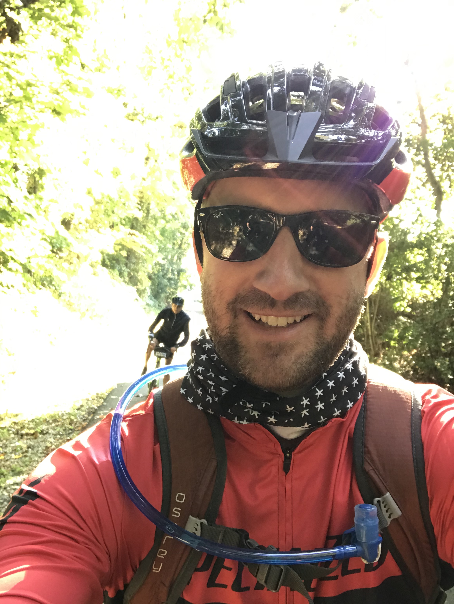

# About Me

I am a General Surgery resident at the New York Presbyterian - Columbia Irving Medical Center. Currently, I am a post-doctoral research fellow in the Columbia University Department of Surgery in the Cardiothroacic Surgery Research Group and also pursuing a Masters of Science in the Department of Biostatistics with a concentration in Clinical Research Methods in the Columbia University Mailmans School of Public Health.  

In my free time, I enjoy the outdoors, hiking, skiing, and riding my road bike.

## Photos 

## Internal Links

[NYC DOH Dashboard](dashboard_template.html)

## External Links

### Data Source

* [NYC Department of Health Restaurant Inspections](https://data.cityofnewyork.us/Health/DOHMH-New-York-City-Restaurant-Inspection-Results/43nn-pn8j)
