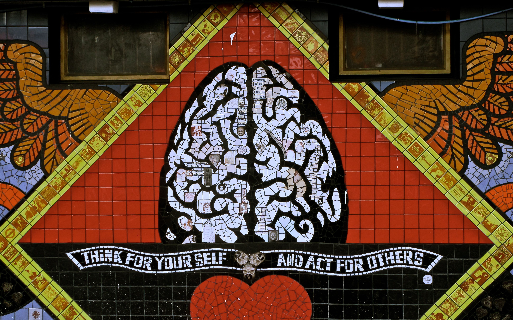

# About Me

I am a General Surgery resident in the [Columbia-Presbyterian](https://columbiasurgery.org/general-surgery-residency) program with an interest in cardiothoracic surgery. 

Currently, I am a post-doctoral research fellow in Dr. Ferrari's lab in the [Cardiothoracic Surgery Research Group](https://columbiasurgery.org/cardiothoracic-surgery-research/program-overview) and pursuing a Master's of Science degree in the Department of Biostatistics in the Mailmans School of Public Health with a concentration in [Clinical Research Methods](https://www.publichealth.columbia.edu/academics/degrees/master-science/clinical-research-methods).  

In my free time, I enjoy the outdoors, hiking, skiing, and riding my road bike.

## Photos 

{width=50%}

## Internal Links
### Dashboard

[NYC DOH Dashboard](dashboard_template.html)

## External Links

### Data Source

* [NYC Department of Health Restaurant Inspections](https://data.cityofnewyork.us/Health/DOHMH-New-York-City-Restaurant-Inspection-Results/43nn-pn8j)
